# APKey - 30 points

**Author**: bertolis  
**Category**: Mobile

## Challenge Description

> This app contains some unique keys. Can you get one?

---
Install `APKey.apk`,có vẻ chỉ có chức năng check Credentials thông thường

<p align="center">
    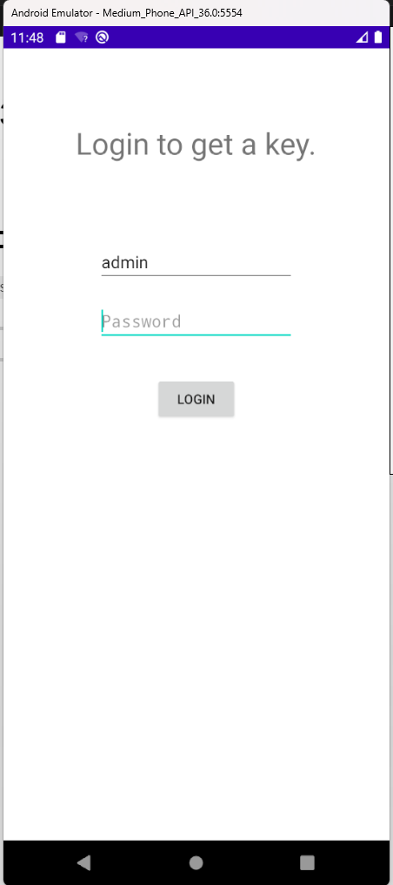
</p>

Dùng `dex2jar` decompile ra xem sao

<p align="center">
    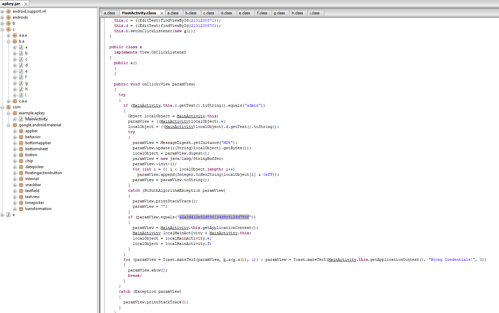
</p>

Liếc sơ qua ta thấy đây là đoạn code check credentials, đính kèm cả hash của password. Cứ tưởng crack md5 là xong nhưng chợt thấy thêm một đoạn xử lí loằng ngoằng sau khi hash
```java
if (MainActivity.this.c.getText().toString().equals("admin"))
{
  Object localObject = MainActivity.this;
  paramView = ((MainActivity)localObject).e;
  localObject = ((MainActivity)localObject).d.getText().toString();
  try
  {
    paramView = MessageDigest.getInstance("MD5");
    paramView.update(((String)localObject).getBytes());
    localObject = paramView.digest();
    paramView = new java/lang/StringBuffer;
    paramView.<init>();
    for (int i = 0; i < localObject.length; i++)
      paramView.append(Integer.toHexString(localObject[i] & 0xFF));
    paramView = paramView.toString();
  }
  catch (NoSuchAlgorithmException paramView)
  {
    paramView.printStackTrace();
    paramView = "";
  }
  if (paramView.equals("a2a3d412e92d896134d9c9126d756f"))
  {
    paramView = MainActivity.this.getApplicationContext();
    MainActivity localMainActivity = MainActivity.this;
    localObject = localMainActivity.e;
    localObject = localMainActivity.f;
  }
}
```

Nó chuyển chuỗi hash thành chuỗi hex, và xử lí java không padding làm chuỗi hex bị thiếu 2 byte
<p align="center">
    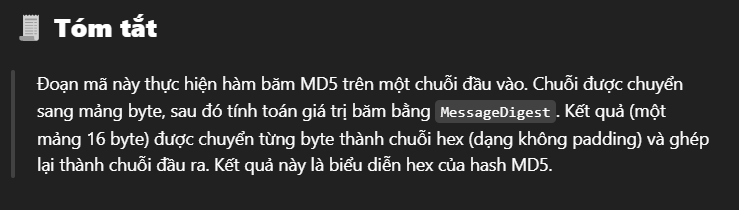
</p>

Thử dịch ngược vài lần nhưng không thành công
<p align="center">
    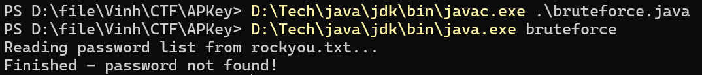
    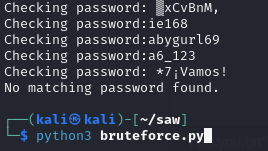
</p>

Xem lại code thì thấy import package khá lạ
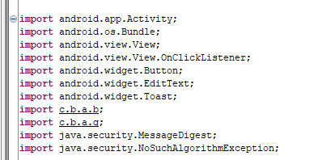
Đây là phần xử lí sau khi nhập đúng Credentials
```java
public class MainActivity extends Activity
{
  public Button b;
  public EditText c;
  public EditText d;
  public b e = new b();
  public g f = new g();

//...

    if (paramView.equals("a2a3d412e92d896134d9c9126d756f"))
    {
        paramView = MainActivity.this.getApplicationContext();
        MainActivity localMainActivity = MainActivity.this;
        localObject = localMainActivity.e;
        localObject = localMainActivity.f;
    }
}
```
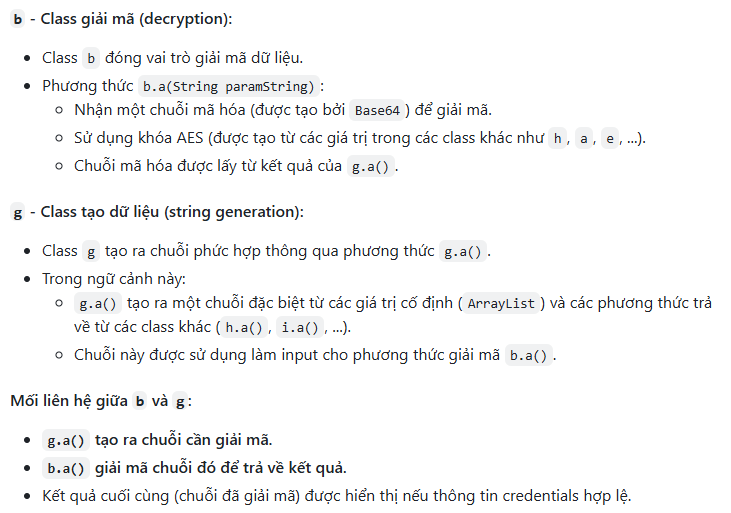
Vậy là ta có thể tự chạy phần code chính này mà không cần crack hash_pass. Nhưng mà nhìn cái đống class trong b.class mà oải, 2 file b.class và g.class đi kèm các class từ `a` → `i`. Trong đó `g` và `b` là hai file chính, các file còn lại chỉ là define ArrayList
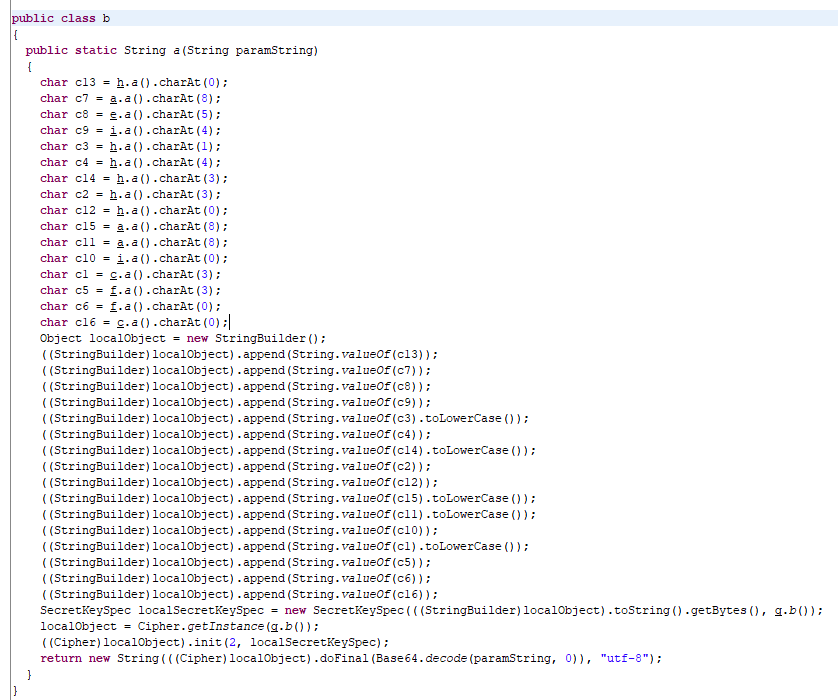
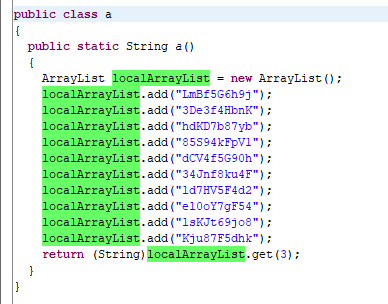
Viết code `java` để nó in ra kết quả của `b.a()`
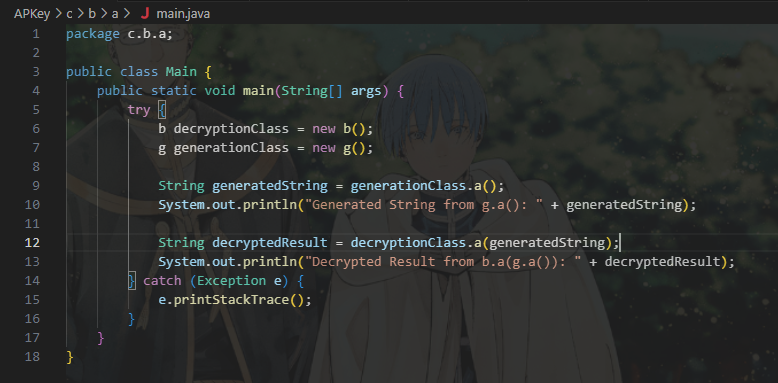
Tất nhiên là phải đính kèm cái đống `a` → `i` kia. Compile và chạy ra được flag.
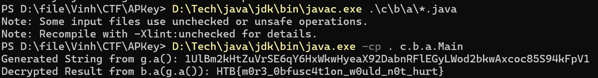

Flag: `HTB{m0r3_0bfusc4t1on_w0uld_n0t_hurt}`


---