# RedTrails - 40 points

**Author**: Ch0p1n  
**Category**: Mobile

## Challenge Description

> The malware forensics lab identified a new technique for hiding and executing code dynamically. A sample that seems to use this technique has just arrived in their queue. Can you help them?

---

Tài nguyên cho file SAW.apk, tải về nhưng mở lên không được

<p align="center">
    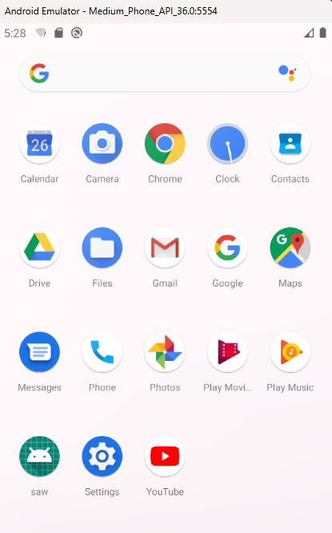
</p>

Dùng `dex2jar` chuyển file .apk sang .jar để mở bằng `jd-gui`

<p align="center">
    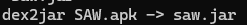
</p>
<p align="center">
    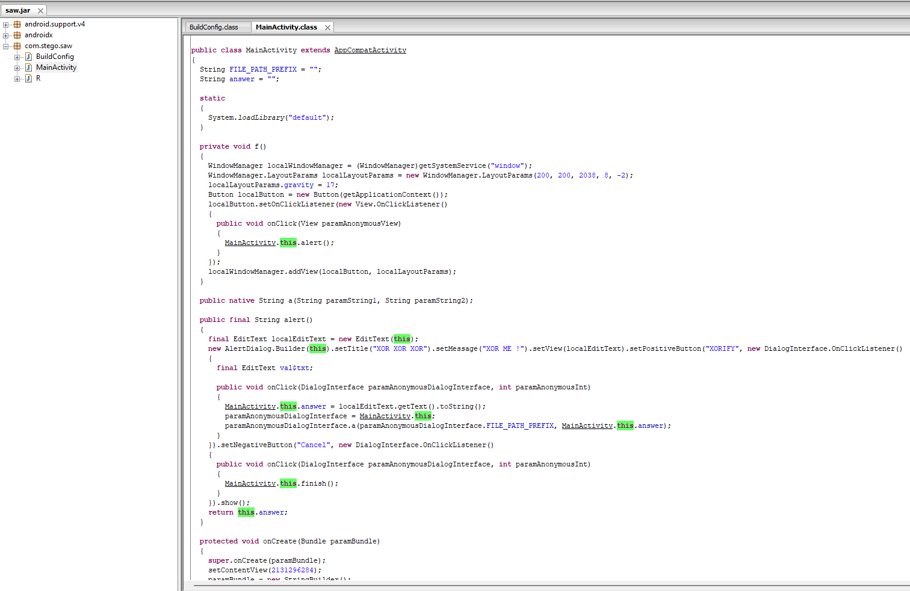
</p>

Đọc [code](asset/SAW/MainActivity.class) thì ta hiểu được luồng hoạt động của file này như sau:

**1. Load thư viện native `libdefault.so`**

```java
static
{
    System.loadLibrary("default");
}
```

**2. Hàm `onCreate()`**
- Set `FILE_PATH_PREFIX` là thư mục dữ liệu app (`/data/data/com.stego.saw`).

```java
paramBundle = new StringBuilder();
paramBundle.append(getApplicationContext().getApplicationInfo().dataDir);
paramBundle.append(File.separatorChar);
this.FILE_PATH_PREFIX = paramBundle.toString();
```

- Kiểm tra Intent để xác định xem ứng dụng có được khởi chạy hợp lệ không.

```java
paramBundle = getIntent().getExtras();
if (paramBundle == null)
{
    finish();
}
else if (!paramBundle.getString("open").equalsIgnoreCase("sesame"))
{
    finish();
}
```

- Thêm Button `Click me...` vào giao diện.

**3. Button mới**
- Click vào Button `Click me...` sẽ tạo ra Button mới bé hơn.
- Click tiếp vào Button mới sẽ hiển thị hộp thoại `XOR ME!` để nhập chuỗi.
- Click nút `XORIFY` trong hộp thoại sẽ gọi hàm `native a(String, String)` với `FILE_PATH_PREFIX` và chuỗi nhập vào.

```java
private void f()
  {
    WindowManager localWindowManager = (WindowManager)getSystemService("window");
    WindowManager.LayoutParams localLayoutParams = new WindowManager.LayoutParams(200, 200, 2038, 8, -2);
    localLayoutParams.gravity = 17;
    Button localButton = new Button(getApplicationContext());
    localButton.setOnClickListener(new View.OnClickListener()
    {
      public void onClick(View paramAnonymousView)
      {
        MainActivity.this.alert();
      }
    });
    localWindowManager.addView(localButton, localLayoutParams);
  }

  public native String a(String paramString1, String paramString2);
```

**4. Hàm  `alert()`**
- Nếu chuỗi nhập vào đúng, file nhị phân sẽ được tạo trong thư mục `/data/data/com.stego.saw/`.

```java
  public final String alert()
  {
    final EditText localEditText = new EditText(this);
    new AlertDialog.Builder(this).setTitle("XOR XOR XOR").setMessage("XOR ME !").setView(localEditText).setPositiveButton("XORIFY", new DialogInterface.OnClickListener()
    {
      final EditText val$txt;

      public void onClick(DialogInterface paramAnonymousDialogInterface, int paramAnonymousInt)
      {
        MainActivity.this.answer = localEditText.getText().toString();
        paramAnonymousDialogInterface = MainActivity.this;
        paramAnonymousDialogInterface.a(paramAnonymousDialogInterface.FILE_PATH_PREFIX, MainActivity.this.answer);
      }
    }).setNegativeButton("Cancel", new DialogInterface.OnClickListener()
    {
      public void onClick(DialogInterface paramAnonymousDialogInterface, int paramAnonymousInt)
      {
        MainActivity.this.finish();
      }
    }).show();
    return this.answer;
  }
```

Ta hiểu không chạy được app này qua UI, nên dùng lệnh sau để mở với Intent `sesame`.
```shell
am start -n com.stego.saw/.MainActivity -e open sesame
```
<p align="center">
    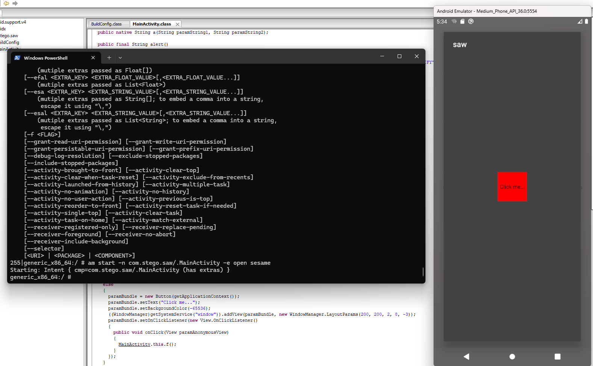
</p>

Click vào Button thì bị crash, check logcat thì thấy lỗi do chưa cấp quyền `SYSTEM_ALERT_WINDOW`
<p align="center">
    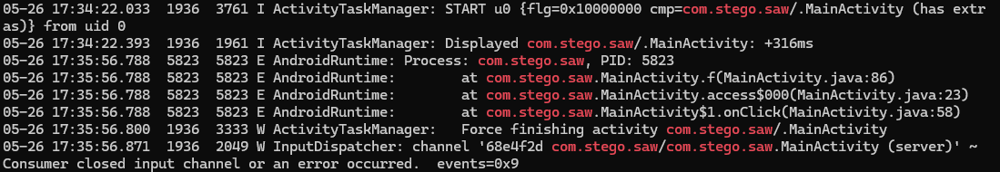
</p>

Chạy `pm grant com.stego.saw android.permission.SYSTEM_ALERT_WINDOW` để cấp quyền.
<p align="center">
    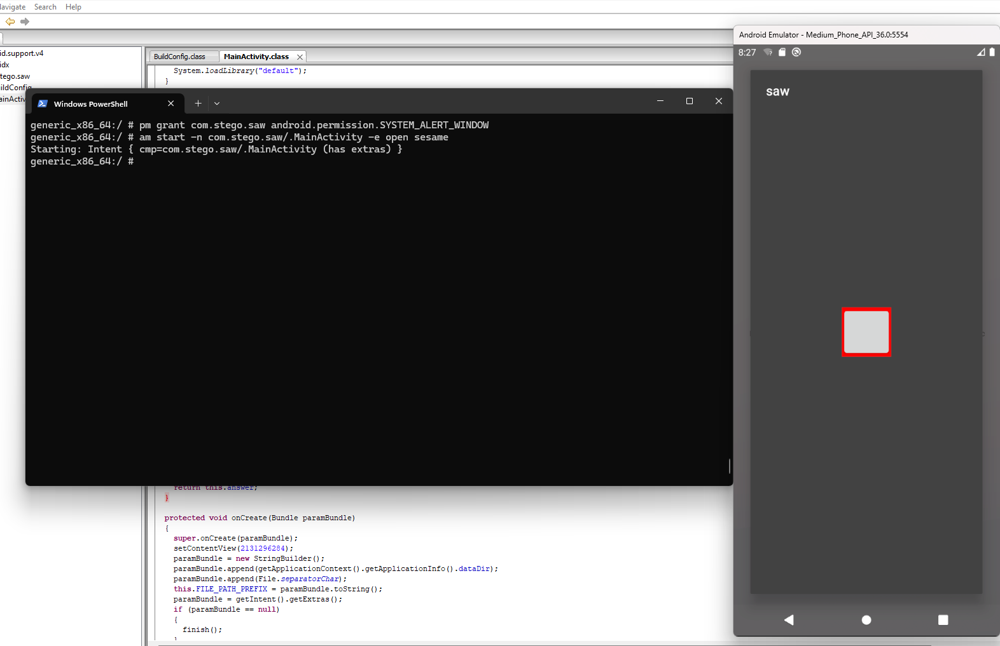
</p>
<p align="center">
    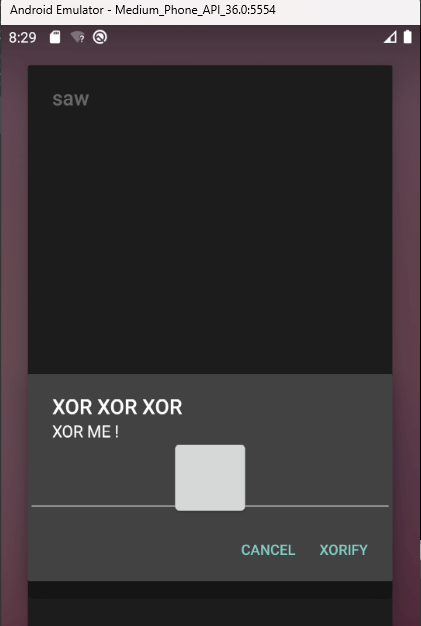
</p>

Oke rồi. Giờ ta cần tìm xem cần nhập gì vào ô này. 
Trong file chính ta không thấy source code hàm `a()`, hàm này được define với `native` nên khá chắc code xử lí nằm trong thư viện `native libdefault.so` được load trước đó.
Giải nén file `.apk`, tìm thấy file ở `\lib\x86_64\libdefault.so`. Mở bằng IDA để xem.
<p align="center">
    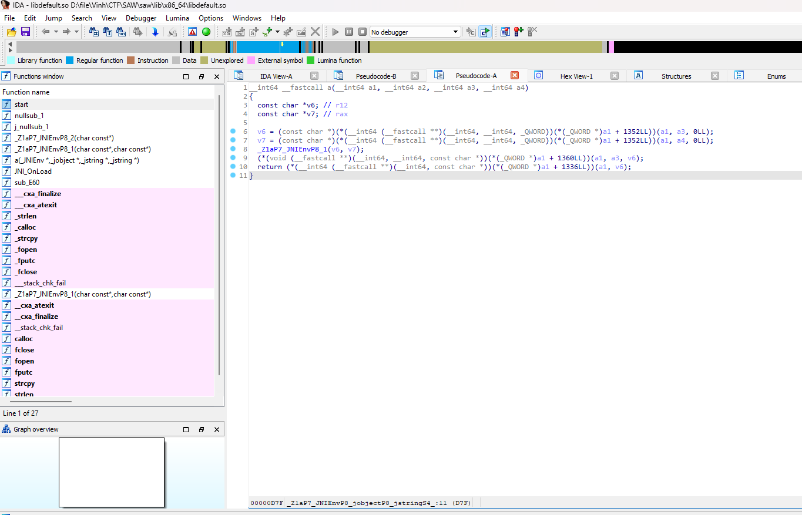
</p>

File này thực hiện:
1. Xử lí tham số và truyền vào `v6` và `v7`
2. Gọi hàm `_Z1aP7_JNIEnvP8_1` với hai tham số `v6` và `v7`. Đây là hàm xử lý chính, có lẽ thực hiện XOR giữa hai chuỗi.

Hàm `_Z1aP7_JNIEnvP8_1` như sau:
<p align="center">
    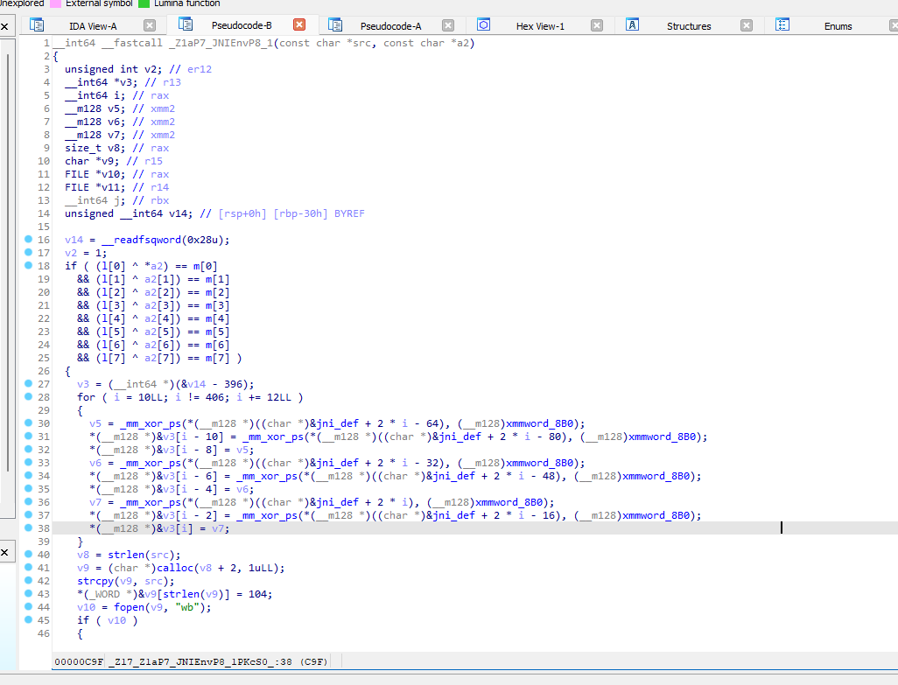
</p>

Đọc chả hiểu gì, nhìn nhanh thì hàm này truyền vào 2 tham số `src` và `a2`
→ Theo thứ tự từ hàm `a()` trước đó thì `src` là `FILE_PATH_PREFIX`, `a2` là chuỗi ta nhập vào.
Có một đoạn code `XOR` giữa `l[]`, `m[]` và `a2[]` → Ta cần `XOR` ngược để tìm được `a2`.

Tiện là ta dễ dàng xem được giá trị 2 chuỗi này.
<p align="center">
    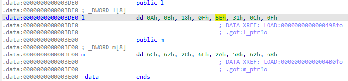
</p>

Script:
```py
l = [0x0A, 0x0B, 0x18, 0x0F, 0x5E, 0x31, 0x0C, 0x0F]
m = [0x6C, 0x67, 0x28, 0x6E, 0x2A, 0x58, 0x62, 0x68]

def calculate_a2(l, m):
    a2 = []
    for i in range(8):
        a2.append(chr(l[i] ^ m[i]))
    return ''.join(a2)

print("a2 =", calculate_a2(l, m))
```
Ta tìm được `a2`
<p align="center">
    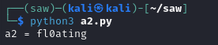
</p>

Nhập vào app thì không thấy gì xảy ra, đọc không hiểu assembly nên bỏ cho [anh ruột](https://chatgpt.com/) giải thích.

<p align="center">
    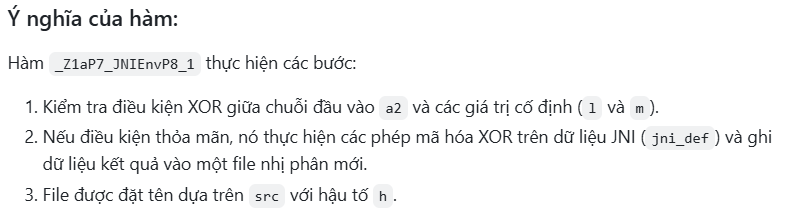
</p>

Vậy là nó sẽ lưu file ở `FILE_PATH_PREFIX`, check xem thì đúng là có file `h`

<p align="center">
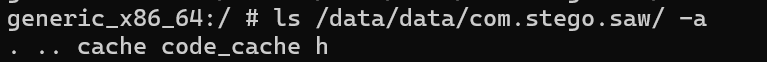
</p>

File này là .dex, ta dùng `jdax` để chuyển thành file `java`
<p align="center">
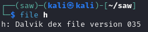
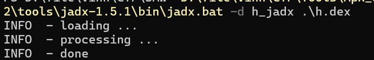
</p>
Thấy flag rồi (tiện ngắm luôn background)

<p align="center">
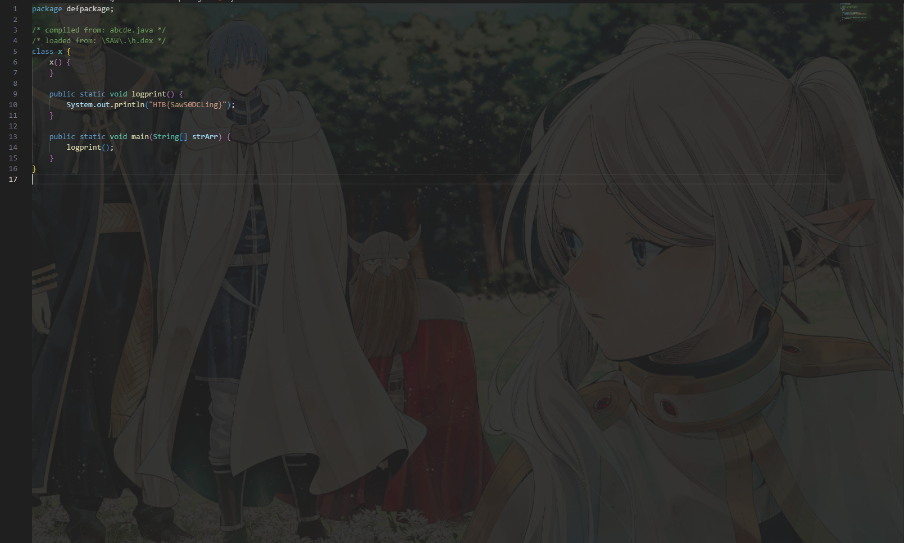
</p>

Flag: `HTB{SawS0DCLing}`

<p align="center">
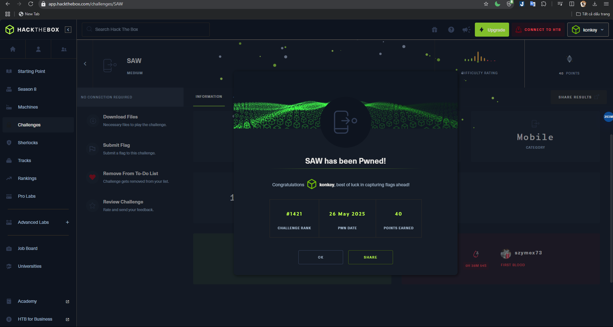
</p>

---