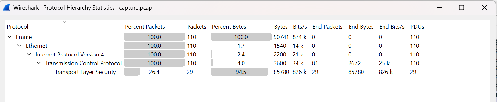
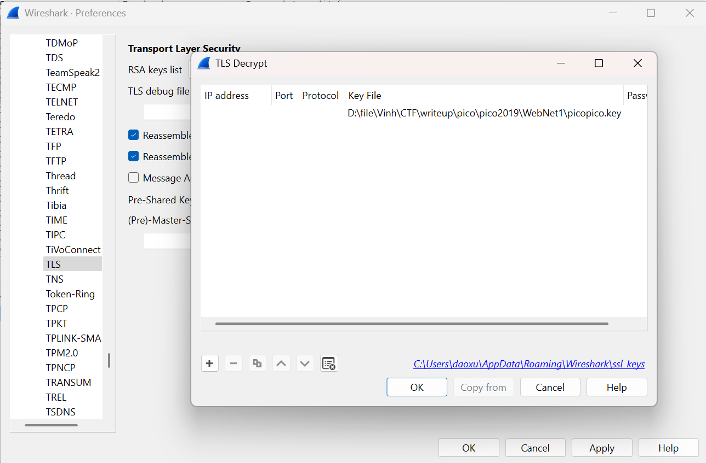
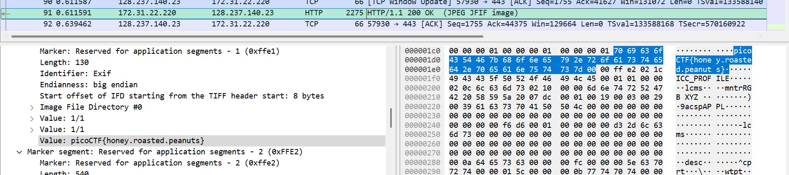

## WebNet1

**Author**: Jason
**Category**: Forensics / Network  
### Challenge Description
> We found this packet capture and key. Recover the flag.
---
Challenge cung cấp 2 file `capture.pcap` và `picopico.key`

Mở file `capture.pcap` trong Wireshark, ta thấy chủ yếu là các gói TCP và TLSv1.2.

Do đề bài đã cung cấp sẵn key, ta tiến hành giải mã như sau:
- Mở Wireshark → Preferences → Protocols → TLS
- Tại phần (RSA Keys List), chọn `Edit` → `Add new key file`
- Thêm file `picopico.key` vào

Sau khi add key thành công, ta lướt các packet và tìm được flag nằm trong một gói **HTTP** đã được giải mã.

Flag: `picoCTF{honey.roasted.peanuts}`

---